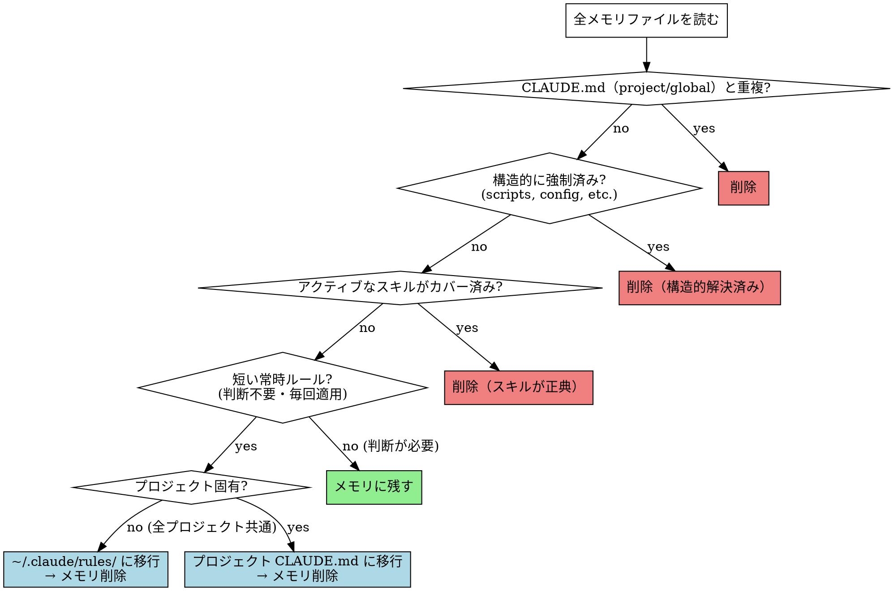

# Memory Triage

メモリエントリを読み、より適切な場所（グローバルルール・CLAUDE.md・スキル）に移行しクリーンアップする。

## 判断フロー

## メモリに残すべきもの

以下はすべての上位チェックを抜けた場合のみ残す:

- **文脈依存の判断ルール** — 「循環変更かどうか」のような状況判断が必要なもの
- **プロジェクト固有の不具合知識** — 特定コンポーネント・ライブラリの挙動
- **歴史的事件記録** — なぜそうなったかの背景（コードからは読めない）
- **worktree 固有のコマンド・手順** — 特殊な実行環境でのみ必要な詳細

## 移行先の優先度

| 移行先 | 適切なケース |
|---|---|
| `~/.claude/rules/development-workflow.md` | ワークフロー上のルール（push 前テスト、supervisor 禁止事項等）|
| `~/.claude/rules/` の他のファイル | code-review.md・git-workflow.md・agents.md 等に対応するルール |
| プロジェクト `CLAUDE.md` | 当該プロジェクトのみ適用されるルール |
| 既存スキルへの追記 | スキルが既にある文脈に属するルール（`pr-check-review-threads` の評価観点等）|

**優先度**: プロジェクト CLAUDE.md > `~/.claude/rules/` > デフォルト動作

## 作業手順

1. 全メモリファイルを `cat` で一括読み込み
2. 各エントリを上記フローで分類（削除 / 移行 / 残す）
3. 重複チェック: 移行前に移行先に既に同内容がないか確認
4. 削除対象: ファイルを削除 → MEMORY.md インデックスから該当行を削除
5. 移行対象: 移行先ファイルに追記 → ファイルを削除 → MEMORY.md から削除
6. MEMORY.md のエントリ説明文が実態と乖離していれば合わせて更新

## よくある削除パターン

- `pnpm を使う` → プロジェクト CLAUDE.md に既記載 → **削除**
- `eas build --no-wait` → package.json スクリプトに既反映 → **削除**
- `PR作成後 ScheduleWakeup` → プロジェクト CLAUDE.md に既記載 → **削除**
- `pr-check-review-threads を使う` → CLAUDE.md + スキル両方で強制済み → **削除**
- `循環変更は拒否` → `pr-check-review-threads` スキルに移行 → **削除**
- `supervisor pane でコード編集禁止` → `development-workflow.md` に移行 → **削除**
